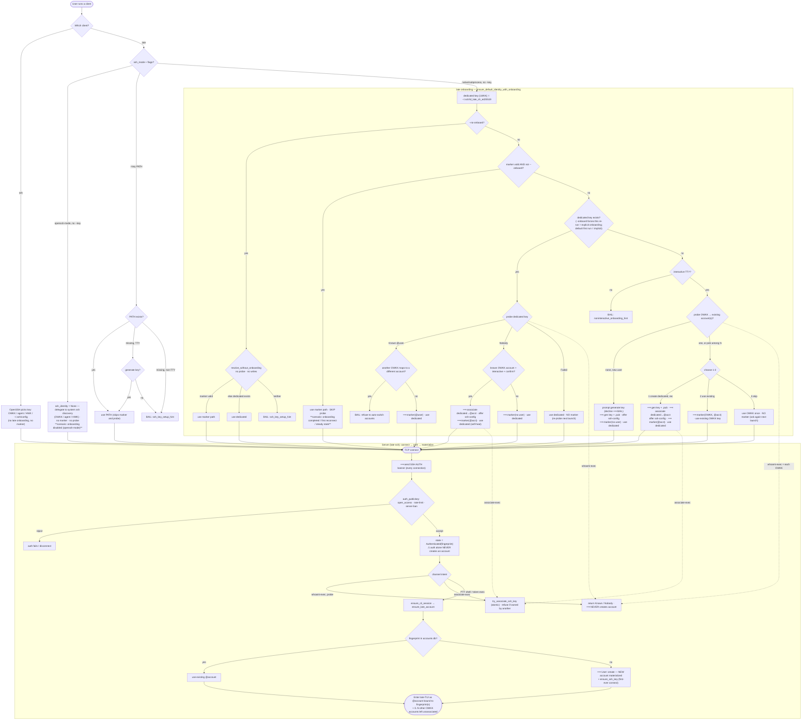

# late-cli Key Onboarding & Connect Flow

A single comprehensive map of how `late` (and raw `ssh`) resolves an identity,
onboards a key, and materializes a late.sh account. It reflects the **implemented**
behavior, traced from the source — not an idealized design.

Source of truth:
- Client mode dispatch: `late-cli/src/main.rs` (`ssh_identity` selection).
- Identity resolution / onboarding tree: `late-cli/src/identity.rs`
  (`ensure_default_identity_with_onboarding`).
- Marker (chosen connect method): `late-cli/src/onboarding.rs`.
- Server connect / banner / auth / materialize: `late-ssh/src/ssh.rs`.

Companion docs: [`PLAN-CLI-IMPROVE-KEY-ONBOARDING.md`](PLAN-CLI-IMPROVE-KEY-ONBOARDING.md),
[`REVIEW-CLI-IMPROVE-KEY-ONBOARDING.md`](REVIEW-CLI-IMPROVE-KEY-ONBOARDING.md).

## Abbreviations

| Term | Meaning |
|---|---|
| `ssh` | OpenSSH client CLI |
| `late` | late-cli client |
| OWKK | OpenSSH well-known keyfile(s): `~/.ssh/{id_ed25519,id_rsa,…}` |
| **LWKK** | late's dedicated key: `~/.ssh/id_late_sh_ed25519` |
| marker | chosen-method record: `~/.config/late/onboarding.json` |
| agent / HWK | OpenSSH-compatible agent / hardware key |
| ⟹ | a side-effect of the step (file write, server mutation) |
| dashed edge | network round-trip that reuses a server exec |

## Flow

## Scenario → path

- **First connect, no pre-existing OWKK** → `late` → `QDED:no` → `QINT:yes` →
  `SEL:none` → **FRESH** (generate LWKK, marker) → server **NEWACC** materializes
  the account.
- **First connect, has pre-existing OWKK** → `SEL: one/N` → **MENU**: R2 (new
  dedicated key, additively associated), R1 (adopt the OWKK as-is), or R3 (skip).
- **Onboarding implicit** = default run, no flag → `QNO:no` → `QFAST:no` (no marker
  yet) → the probe tree.
- **Onboarding explicit** = `--onboard` → forces `QFAST:no` even when a marker
  exists → re-runs the probe tree (and overwrites the marker).
- **Onboarding disabled** = `--no-onboard` → **RWO**: marker → dedicated → hint, no
  probe/prompt/write.
- **Onboarding disabled, openssh-mode** = `--ssh-mode openssh` → **OSSH**: late's key
  helper is skipped entirely; OpenSSH resolves the key (agent/HWK/`~/.ssh/config`).
- **Onboarding completed / first-ever reconnect / steady state** = marker present &
  fingerprint still matches → `QFAST:yes` → **FAST**, which *skips the server probe*
  and goes straight to connect.
- **Account association** = the `associate-exec` → **ASSOC** node, driven by R2 and
  the Nobody self-heal (NBA); it is the atomic claim path (refuses keys owned by
  another account — review L1).
- **AUTH banner** = **BAN**, emitted on *every* TCP connection (ssh and late alike),
  before pubkey auth.
- **Successful TUI entry as `@account` with fingerprint(s) + 0..N other unassociated
  OWKK accounts** = the **TUI** terminal; the "others" are accounts surfaced by the
  OWKK probe that the user didn't pick (R3 skip, or non-chosen entries of the
  multi-account picker).

## Invariants the chart encodes

- **Auth never materializes an account.** `auth_publickey` only sets
  `Authenticated(fingerprint)`.
- **whoami probes never materialize an account** either — they are pure lookups, so
  onboarding can probe freely.
- **Only a PTY shell or token-exec materializes** an account (NEWACC), via
  `ensure_cli_session → ensure_late_account`.
- **A marker is written on every committed native decision** — *except* R3-skip and a
  Failed probe (both intentionally re-ask/re-probe next launch).
- **`--no-onboard` and a valid marker both skip the network probe** entirely.
- **`--key PATH` and openssh-mode bypass the marker/probe machinery** — explicit key
  selection and OpenSSH-native discovery, respectively.
